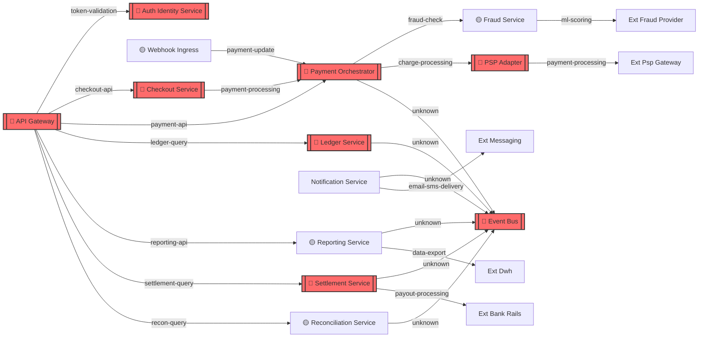

# ACMEPay Payment System

A dummy monorepo modeling a real-world payment processing system, used for demonstrating [SCP (System Capability Protocol)](https://github.com/krackenservices/scp-definition) architecture diagrams.

## Architecture

```
┌─────────────────────────────────────────────────────────────────┐
│ EXTERNAL UPSTREAMS (call into us)                               │
│   Web/Mobile Checkout, Merchant Backend, Admin Portal, Batch    │
└──────────────────────────────┬──────────────────────────────────┘
                               ▼
┌─────────────────────────────────────────────────────────────────┐
│ EDGE (Trust Boundary: Public Edge)                              │
│   ├── api-gateway         Routes to internal services           │
│   └── auth-identity       Authentication & identity             │
└──────────────────────────────┬──────────────────────────────────┘
                               ▼
┌─────────────────────────────────────────────────────────────────┐
│ CORE (Trust Boundary: Internal Microservices)                   │
│   ├── checkout-service    Initiates payment flows               │
│   ├── payment-orchestrator  Central payment coordination        │
│   ├── fraud-service       Fraud detection                       │
│   ├── psp-adapter         Payment gateway integration           │
│   ├── webhook-ingress     Receives PSP callbacks                │
│   ├── ledger-service      Transaction ledger                    │
│   ├── notification-service  Email/SMS notifications             │
│   ├── settlement-service  Bank settlements                      │
│   ├── reconciliation-service  Transaction reconciliation        │
│   ├── reporting-service   Analytics & reporting                 │
│   └── event-bus           Kafka-like event backbone             │
└──────────────────────────────┬──────────────────────────────────┘
                               ▼
┌─────────────────────────────────────────────────────────────────┐
│ EXTERNAL DOWNSTREAMS (we call out to)                           │
│   PSP Gateway, Fraud Provider, Bank Rails, Messaging, DWH       │
└─────────────────────────────────────────────────────────────────┘
```

## Services

| Layer | Service         | URN                            |
| ----- | --------------- | ------------------------------ |
| Edge  | API Gateway     | `urn:scp:acmepay-gateway`      |
| Edge  | Auth/Identity   | `urn:scp:acmepay-auth`         |
| Core  | Checkout        | `urn:scp:acmepay-checkout`     |
| Core  | Orchestrator    | `urn:scp:acmepay-orchestrator` |
| Core  | Fraud           | `urn:scp:acmepay-fraud`        |
| Core  | PSP Adapter     | `urn:scp:acmepay-psp`          |
| Core  | Webhook Ingress | `urn:scp:acmepay-webhook`      |
| Core  | Ledger          | `urn:scp:acmepay-ledger`       |
| Core  | Notification    | `urn:scp:acmepay-notify`       |
| Core  | Settlement      | `urn:scp:acmepay-settlement`   |
| Core  | Reconciliation  | `urn:scp:acmepay-recon`        |
| Core  | Reporting       | `urn:scp:acmepay-reporting`    |
| Core  | Event Bus       | `urn:scp:acmepay-eventbus`     |

## Usage

Use with [scp-viewer](https://github.com/krackenservices/scp-viewer) to visualize the architecture:

```bash
git clone https://github.com/krackenservices/scp-viewer.git
git clone https://github.com/krackenservices/scp-demo.git

cd scp-viewer
V_DATA=../scp-demo/ACMEPay make scan
```

Use with [scp-cli](https://github.com/krackenservices/scp-cli) to generate diagrams:

```bash
scp-cli scan ./scp-demo/ACMEPay --export mermaid -o acmepay.mmd
```

## Architecture Diagram


