# DupCap Demo

This demo showcases **capability grouping** in SCP visualizations. It demonstrates a typical microservices architecture with a Backend API that depends on multiple external systems for the same capability.

## Architecture

The Backend API integrates with numerous external systems, grouped by their capabilities:

- **Code Management** (5 providers): Azure DevOps, GitHub, GitLab, Bitbucket Cloud, Bitbucket Server
- **CI/CD Pipelines** (2 providers): Jenkins, AWS CodePipeline
- **Authentication** (3 providers, mixed types): OIDC Provider & AWS Cognito (REST), LDAP (Data)

## Services

| Service         | Tier | Description                                                |
| --------------- | ---- | ---------------------------------------------------------- |
| **Backend API** | 1    | Express REST API for SDLC integration and analysis         |
| **ML API**      | 2    | FastAPI service providing ML predictions                   |
| **MCP Server**  | 3    | Model Context Protocol server for AI assistant integration |
| **Web UI**      | 2    | Vue.js frontend for visualization                          |

## Architecture Diagram

```mermaid
flowchart LR

    %% Systems
    backend_api[["🔴 Backend API"]]
    database["Database"]
    mlapi["🟡 ML API"]
    sonarqube["Sonarqube"]
    azure_devops["Azure Devops"]
    github["Github"]
    gitlab["Gitlab"]
    bitbucket_cloud["Bitbucket Cloud"]
    bitbucket_server["Bitbucket Server"]
    jenkins["Jenkins"]
    aws_codepipeline["Aws Codepipeline"]
    dynatrace["Dynatrace"]
    jira["Jira"]
    servicenow["Servicenow"]
    oidc_provider["Oidc Provider"]
    aws_cognito["Aws Cognito"]
    ldap["Ldap"]
    mcp_server["MCP Server"]
    web_ui["🟡 Web UI"]

    %% Capability Groups
    backend_api --> code_management_1

    subgraph code_management_1["code-management"]
        azure_devops
        github
        gitlab
        bitbucket_cloud
        bitbucket_server
    end

    backend_api --> ci_cd_pipelines_2

    subgraph ci_cd_pipelines_2["ci-cd-pipelines"]
        jenkins
        aws_codepipeline
    end

    backend_api --> authentication_3

    subgraph authentication_3["authentication"]
        subgraph data_1["data"]
            ldap
        end
        subgraph rest_2["rest"]
            oidc_provider
            aws_cognito
        end
    end


    %% Direct Dependencies
    backend_api -->|data-storage| database
    backend_api -->|ml-predictions| mlapi
    backend_api -->|code-quality-analysis| sonarqube
    backend_api -->|observability-metrics| dynatrace
    backend_api -->|issue-tracking| jira
    backend_api -->|incident-management| servicenow
    mcp_server -->|rest-api| backend_api
    web_ui -->|rest-api| backend_api

    %% Styling
    classDef critical fill:#ff6b6b,stroke:#333,stroke-width:2px
    class backend_api critical
```



## Key Features Demonstrated

✅ **Capability Grouping**: Multiple providers for the same capability are visually grouped  
✅ **Mixed Type Handling**: Nested subgraphs when a capability has providers of different types (e.g., REST + Data)  
✅ **Consumer-Scoped**: Each consumer gets its own capability groups  
✅ **Direct Edges**: Single providers remain as labeled edges

## Usage

Generate this diagram:

```bash
scp-cli scan ./scp-demo/DupCap -e mermaid -o diagram.mmd
```
