# Services Demo

A minimal three-tier web application demonstrating basic SCP structure with frontend, backend API, and database.

## Overview

Simple web application architecture showing the fundamental pattern of a user-facing frontend consuming a REST API that depends on a database.

## Services

| Service           | Tier | Description           |
| ----------------- | ---- | --------------------- |
| **Demo API**      | 1    | REST API backend      |
| **Demo Database** | 1    | PostgreSQL data store |
| **Demo Frontend** | 2    | Web UI                |

## Architecture Diagram

```mermaid
flowchart LR

    %% Systems
    rest[["🔴 Demo API"]]
    postgres[["🔴 Demo Database"]]
    web["🟡 Demo Frontend"]

    %% Direct Dependencies
    rest -->|data-storage| postgres
    web -->|rest-api| rest

    %% Styling
    classDef critical fill:#ff6b6b,stroke:#333,stroke-width:2px
    class rest,postgres critical
```



## Key Features Demonstrated

✅ **Simple three-tier architecture**  
✅ **Clear dependency chain**: Frontend → API → Database  
✅ **Tier classification**: Critical backend (Tier 1), Standard frontend (Tier 2)

## Usage

Generate this diagram:

```bash
scp-cli scan ./scp-demo/services -e mermaid -o diagram.mmd
```
